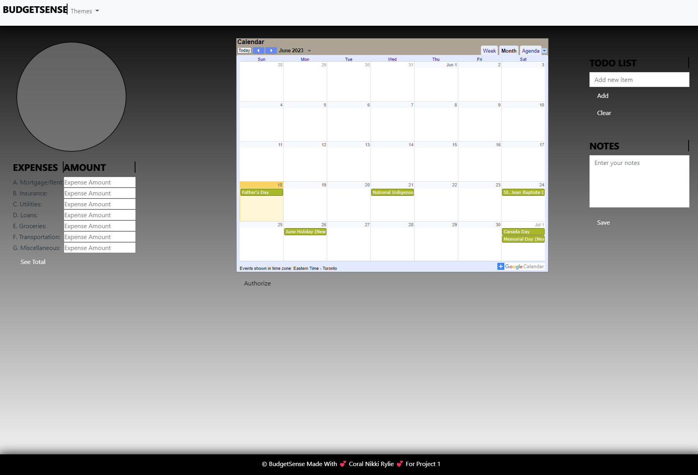

# BudgetSense

## Description

We were tasked with our first group project.
We have chosen to code:

Our project will centre around a budgeting calendar with the user being able to input reoccurring and singular expenses that will display on a monthly calendar spread, accompanied by a pie chart that can open up to a modal display that shows spent income and on what and remaining funds for the month.

APIs Used:
- Google Calendar API (https://console.cloud.google.com/apis/library/calendar-json.googleapis.com?authuser=2&project=encoded-source-389221)
- D3api Pie Chart API ( https://d3-graph-gallery.com/index.html ) 

What We learned during the project.
- How to Read API documentation.
- How to work on a team.
- How to use branches.
- How to work with team members coding variations. 
- How to add css animation.  

We followed the criteria below provided by the class instructors.

## Project Requirements

- Use a CSS framework other than Bootstrap.
- Be deployed to GitHub Pages.
- Be interactive (in other words, accept and respond to user input).
- Use at least two server-side APIsLinks to an external site..
- Use modals instead of alerts, confirms, or prompts.
- Use client-side storage to store persistent data.
- Be responsive.
- Have a polished UI.
- Have a clean repository that meets quality coding standards (file structure, naming conventions, best practices - for class/id naming conventions, indentation, quality comments, and so on).
- Have a quality README (including a unique name, description, technologies used, screenshot, and link to the - - - deployed application).

## Presentation Requirements

- Use this Project Presentation TemplateLinks to an external site. to address the following:
- Elevator pitch: A one-minute description of your application.
- Concept: What is your user story? What was your motivation for development?
- Process: What were the technologies used? How were tasks and roles broken down and assigned? What challenges - - did you encounter? What were your successes?
- Demo: Show your stuff!
- Directions for future development.
- Links to the deployed application and the GitHub repository.

## Mock-Up

The following image shows the web application.

> **Note**: Default Theme Currently Displayed ( Sesonal Themes In Drop Down Menu.)

## Credits
The following is what we all contributed to the project.
It was a joy to work with my team.
Thank You , For all your hard work and dedication to our first project.

### Nikki - nikkivno
- README
- Bootstrap
- Pie chart Expenses
- JS
- Pie chart D3 API
- Budgeting/Expense Form 

### Coral -  xNoirNightx
- README
- Colour Theme
- Todo / Notes
- Bootstrap
- Animation
- JS

### Riley - Riley19James
- README
- Calendar
- Google Calender API (events js)
- CSS reset
- Project Slide

> **Note**: Project Requirements was provided to us in class UNB-VIRT-FSF-PT-04-2023-U-LOLC for Project 1.

## Our Githubs

- Nikki - https://github.com/nikkivno
- Coral - https://github.com/xNoirNightx
- Riley - https://github.com/Riley19James

## Slideshow
https://docs.google.com/presentation/d/1Q98n1lEFSPtDmHimeYFuH0_mb2wHd5Jehta66lpREYY/edit#slide=id.g29f43f0a72_0_10

## License

MIT